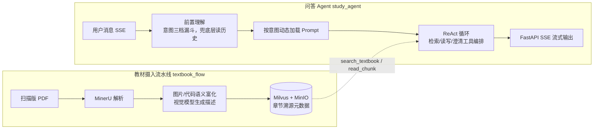

# 研途智学 · Textbook RAG Agent

面向复习备考的教材问答与助手系统：将扫描版计算机教材处理为**可追问、可溯源**的知识库，覆盖教材摄入、混合检索、多轮问答与离线评测四大环节。独立完成前后端与服务化联调。

 

## 核心指标

| 指标 | 结果 | 说明 |
|---|---|---|
| Recall@5（300 题检索评测集） | 79.6% → **84.8%** | 快路径（dense/sparse 混合召回）→ 深度路径（HyDE + RRF + Rerank） |
| 多轮会话评测 | **50 会话 × 200 轮全部通过** | 无会话串扰；检索触发率 88% → 99%，追问轮 hit@5 0.662 → 0.887 |
| 上下文 Prompt Token | 平均 **-30%** | 历史轮检索原文压缩为可回读存根（`stub_old_search_results` middleware） |

评测脚本与指标计算均在 [app/eval/](app/eval) 内，可离线复现（评测集与教材 PDF 因体积与版权未随仓库分发，见「评测复现」）。

## 架构

系统由两条 LangGraph 流水线组成，共享一套存储（Milvus / MongoDB / MinIO）：



### 检索链路（快慢双路径）

- **检索问句**：由模型在 ReAct 循环里结合对话历史自行组织成自包含问句（检索侧无状态，不读历史），不做前置改写，省一次 LLM 往返；
- **快路径**：BGE-M3 dense + sparse 混合召回（WeightedRanker 0.8/0.2），Milvus 单请求完成；
- **深度路径**：在原查询之外并行生成 HyDE 假设文档向量做第二路召回，RRF（k=60）融合两路结果，再过 BGE-Reranker-large 精排；
- **上下文控制**：wrap_model_call middleware 将历史轮检索原文替换为含 chunk id 的短存根，模型可按 id 调 `read_chunk` 重取原文，state 与审计链路不受影响。

### Agent 能力

- 意图三级漏斗路由（关键词 → embedding 相似度 → LLM 结构化输出兜底），按意图动态装配 system prompt 行为块（工具集固定）；对话历史只喂给兜底层，用于消解「那再来十道」这类省略句；兜底层单独收紧超时且不重试，判不准即回退「讲解」块，不阻塞主链路；
- 工具：`search_textbook`（限定教材检索）、`read_chunk`（按 id 重取片段）、`list_chapters`、`write_file`/`edit_file`/`append_file`（资料生成，Human-in-the-loop 写盘确认）、`clarify`（澄清反问）、联网搜索（MCP）；
- 会话状态经 MongoDB checkpointer 持久化，`thread_id = user_id:session_id`，支持断流续跑与写盘确认 resume。

## 技术栈

LangGraph / LangChain · FastAPI (SSE) · Milvus 2.4 · MongoDB · MinIO · BGE-M3 · BGE-Reranker-large · MinerU · Vue 3 / TypeScript · Docker · uv · pytest / ruff

## 快速开始

```bash
# 1. 启动依赖中间件（Milvus + etcd + MinIO + MongoDB + Attu）
docker compose -f docker/docker-compose.yml up -d

# 2. 安装依赖并配置环境变量
uv sync
cp .env.example .env   # 填入 LLM API Key 等，模型默认走阿里云百炼 OpenAI 兼容接口

# 3. 启动服务（启动时预热 BGE-M3 / Reranker，首个请求不再背冷启动）
python -m app.api.main   # http://localhost:8000, 交互式文档见 /docs
```

首次运行会从 HuggingFace 下载 `BAAI/bge-m3` 与 `BAAI/bge-reranker-large`；CPU 环境可将 `EMBEDDING_DEVICE/RERANKER_DEVICE` 保持为 `cpu`（GPU 需按 pyproject 中注释切换 torch 源）。

### 主要接口

| 方法 | 路径 | 说明 |
|---|---|---|
| POST | `/upload` | 批量上传扫描版教材 PDF |
| POST | `/resolve` | 执行摄入流水线，SSE 实时进度，支持断点续跑 |
| GET | `/list` | 教材库列表（分页） |
| POST | `/study/chat` | 统一对话入口，SSE 事件流（tool/thought/token/ask_confirm/ask_clarify/done） |
| GET | `/study/files` `/study/file` | 任务产物文件列表与内容读取（路径沙箱校验） |

## 评测复现

```bash
# 检索离线消融：300 题（6 本教材 × 50），各配置 Recall/Hit/NDCG/MRR 对比 + 显著性检验
python -m app.eval.run_ablation

# 问题重写消融（历史链路复现）：原问句 vs 当年重写问句单路替换 + 双路 RRF 融合
# 前置重写已下线，此脚本只读旧 metrics.log 复现结论，新日志样本数为 0
python -m app.eval.run_rewrite_ablation

# 多用户多轮会话评测：50 会话 × 200 轮，含延迟/token/检索触发率统计
python -m app.eval.run_multi_user_eval
```

> 评测依赖 `data/` 下的题目集与已入库教材。教材 PDF 与评测集全量数据因版权和体积未上传；如需复现，可用自己的教材走 `/upload → /resolve` 摄入后，参照 [app/eval/dataset.py](app/eval/dataset.py) 的格式构造题目。

## 目录结构

```
app/
├── api/            # FastAPI 入口与路由（SSE 流式、写盘确认/澄清续跑）
├── study_agent/    # 问答 Agent：graph 装配、工具、middleware、意图路由
├── textbook_flow/  # 教材摄入流水线：解析、富化、切分入库
├── eval/           # 离线评测：数据集、指标、消融实验
├── prompts/        # 按意图动态加载的 system prompt
├── clients/        # Milvus / MongoDB / MinIO 客户端
└── utils/          # 嵌入/重排批处理、检索原语
docker/             # Milvus 全家桶 + MongoDB + MinIO 编排
docs/               # 设计文档（图片 caption、chunk 对齐修复、网关设计）
tests/              # pytest 单测（默认排除 integration 标记的端到端测试）
```

## 测试与代码检查

```bash
uv run pytest            # 单元测试（默认 -m "not integration"，不依赖真实外部服务）
uv run pytest -m integration   # 端到端测试，需 .env 中的真实凭据
uv run ruff check .
```
